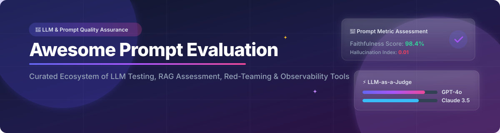

# 🚀 Awesome Prompt Evaluation

  

  
  
  
  
  

## 🌟 Top Prompt Evaluation Platforms Ecosystem

**Curated List of SaaS Products & Open-Source GitHub Projects**  
*Focused on LLM Evaluation, Prompt Testing, RAG Assessment, Red Teaming, Observability & AI Quality Assurance*  

**Last updated: August 2026**

---

### 📚 SEO & Key Features Overview
Welcome to the ultimate directory for **LLM Evaluation, Prompt Engineering, RAG Assessment, and AI Quality Assurance**. Whether you are looking for enterprise-grade SaaS platforms with advanced observability dashboards or high-performance open-source tools for local CI/CD pipelines, this list indexes the top-tier frameworks used by AI developers worldwide.

**Core Categories Covered:**
- 🧪 **Offline & Automated Evaluation**: Unit test prompts, compare multi-model responses, and execute regression test suites.
- 🔍 **RAG Assessment**: Reference-free metrics for faithfulness, context relevance, recall, and answer correctness.
- 🛡️ **AI Safety & Red Teaming**: Automated prompt injection defense, hallucination detection, and jailbreak benchmarking.
- 📊 **LLM Observability & Tracing**: OpenTelemetry-based production tracking, latency analytics, and dataset generation.

---

## 🗂️ Table of Contents

- [📊 SaaS & Hosted Platforms](#-saas--hosted-platforms)
- [💻 Open-Source GitHub Projects](#-open-source-github-projects)
- [⚡ Ecosystem Summary](#-ecosystem-summary)
- [🤝 How to Contribute](#-how-to-contribute)
- [⚠️ Disclaimer](#%EF%B8%8F-disclaimer)
- [⭐ Star History](#-star-history)

---

## 📊 SaaS & Hosted Platforms

Below is a curated table of commercial SaaS platforms for LLM evaluation and observability, sorted in descending order by **Company Scale / Valuation / Funding**.

| Product Name | Description | Starting Price | Free Tier Limits | Company Scale / Valuation / Funding |
| :--- | :--- | :--- | :--- | :--- |
| **[Braintrust](https://www.braintrust.dev/)** 🧠 | Enterprise evaluation-first platform for testing, logging, and iterating on LLM applications with human review workflows. | $249/month (Pro Plan) | Free Starter tier ($0/mo) with 1 GB processed data/month, 10,000 scores/month, and 14-day retention | **$800M Valuation** ($121M Total Funding) |
| **[Arize Phoenix / Arize AX](https://phoenix.arize.com/)** 🦅 | Observability and evaluation platform (AX) providing production monitoring, LLM tracing, and AI quality guardrails. | $50/month (AX Pro Plan) | Free AX tier with 25,000 spans/month and 1 GB storage (or unlimited via OSS Phoenix) | **$741.8M Valuation** ($135M Total Funding) |
| **[Promptfoo](https://www.promptfoo.dev/)** ⚡ | Managed LLM evaluation, prompt testing, and automated red-teaming platform for enterprise CI/CD workflows. | $50/month (Team Plan) | Free open-source CLI/self-hosted tier with up to 10,000 red-teaming probes/month | **Acquired by OpenAI** ($86M prior valuation, $23.6M funding) |
| **[Galileo](https://www.rungalileo.io/)** 🔭 | AI evaluation and observability platform focused on agent and LLM output quality with specialized guardrail scorers. | $100/month (Pro Plan) | Free tier ($0/mo) with 5,000 traces/month and unlimited user access | **~$200M Valuation** ($68M Total Funding) |
| **[OpenPipe](https://openpipe.ai/)** 🛠️ | Platform for fine-tuning, evaluation, and optimization of LLM applications with dataset and experiment tracking. | $0.48 / 1M tokens (Pay-As-You-Go Training) | Self-hosted open-source framework ART available for free local GPU training; managed platform is pay-as-you-go | **Acquired by CoreWeave** ($6.7M prior seed funding) |
| **[Humanloop](https://humanloop.com/)** 🔁 | Collaborative prompt engineering, evaluation, and monitoring platform for LLM applications. | Contact Sales (Custom Enterprise Pricing) | Free trial plan with 2 team members, 50 evaluation runs, and 10,000 logs/month | **Team Acquired by Anthropic** ($7.91M prior seed funding) |
| **[Langfuse](https://langfuse.com/)** ⚡ | Open-source LLM engineering platform for tracing, prompt versioning, evaluations, and production observability. | $29/month (Cloud Core Plan) | Free Hobby Cloud tier with 50,000 billable units/month, 30 days retention, and up to 2 users | **Acquired by ClickHouse** ($4.5M prior seed funding) |
| **[DeepEval / Confident AI](https://deepeval.com/)** 🧪 | Hosted collaboration and production evaluation platform built around DeepEval metrics for systematic testing. | $200/month (Starter Plan) | Free tier ($0) with 2 user seats, 1 project, and 5 test runs/week | **$2.2M Seed Funding** (Confident AI) |
| **[Ragas](https://docs.ragas.io/)** 🎯 | Specialized evaluation framework focused on Retrieval-Augmented Generation (RAG) pipelines with reference-free metrics. | $0/month (Self-Hosted Framework) | Free & open-source Python library (Apache 2.0); self-hostable with no platform usage cap | **Venture Backed** (Exploding Gradients) |

---

## 💻 Open-Source GitHub Projects

Sorted in descending order by **GitHub Star Count**. Click on any star badge to visit the project's stargazers page!

- **[Langfuse](https://github.com/langfuse/langfuse)**  ⚡  
  Fully open-source LLM engineering platform for tracing, prompt versioning, evaluations, datasets, and metrics — self-hostable and framework-agnostic (MIT).

- **[Promptfoo](https://github.com/promptfoo/promptfoo)**  🛡️  
  Leading open-source CLI and library for evaluating prompts, agents, and RAGs, with powerful red-teaming, multi-provider comparison, and CI/CD integration (MIT).

- **[Opik](https://github.com/comet-ml/opik)**  📊  
  Open-source platform by Comet for evaluating, testing, and monitoring LLM applications and agentic workflows with comprehensive metrics.

- **[Ragas](https://github.com/explodinggradients/ragas)**  🎯  
  Open-source library specialized in evaluating RAG pipelines with metrics such as faithfulness, answer relevancy, context precision, and recall (Apache 2.0).

- **[OpenAI Evals](https://github.com/openai/evals)**  🤖  
  Open-source framework for evaluating LLMs and systems with registered evals, model-graded scoring, and reproducible benchmarks (MIT).

- **[DeepEval](https://github.com/confident-ai/deepeval)**  🧪  
  Open-source Python framework (Pytest-style) for LLM evaluation with 50+ metrics covering hallucination, RAG, agents, safety, and custom criteria (Apache 2.0).

- **[LM Evaluation Harness](https://github.com/EleutherAI/lm-evaluation-harness)**  🏋️  
  The standard framework for broad, zero-shot and few-shot evaluation of language models over 60+ standard academic benchmarks (Apache 2.0).

- **[Arize Phoenix](https://github.com/Arize-ai/phoenix)**  🦅  
  Open-source AI observability and evaluation platform with tracing, LLM-as-judge evaluators, datasets, and OpenTelemetry support.

- **[Giskard](https://github.com/Giskard-AI/giskard)**  🔍  
  Open-source AI quality management system for testing, debugging, and red-teaming LLM applications, RAG pipelines, and AI agents.

- **[TruLens](https://github.com/truera/trulens)**  🔬  
  Open-source library for evaluating and tracking LLM applications with feedback functions, RAG triads, and explainability features.

---

### 💡 Additional Open-Source Evaluation Tooling

- 🛠️ **Code-first evaluation**: **DeepEval** (Pytest-style) and **Promptfoo** (YAML/CLI) lead offline and CI evaluation workflows.
- 🎯 **RAG specialists**: **Ragas** and **TruLens** remain the go-to open-source libraries for retrieval-augmented generation metrics.
- 📈 **Observability + eval**: **Langfuse**, **Opik**, and **Arize Phoenix** provide self-hostable tracing and evaluation platforms.
- 🔒 **Benchmarks & safety**: **OpenAI Evals**, **LM Evaluation Harness**, and **Giskard** support reproducible and security-focused testing.

---

## ⚡ Ecosystem Summary

When building custom AI quality stacks:
1. Combine **Promptfoo** or **DeepEval** for offline/CI prompt testing.
2. Integrate **Ragas** or **TruLens** for specialized RAG metric evaluations.
3. Deploy **Langfuse**, **Opik**, or **Phoenix** for production tracing and online monitoring.

---

## 🤝 How to Contribute

1. Fork the repo.
2. Add/edit entries in `README.md` (following existing table & list structure).
3. Include: name, link, star count badge, 1–2 sentence description, and tier info.
4. Submit a PR with a short explanation.

⭐ Star the repo if you find it useful!

---

## ⚠️ Disclaimer

- This is a **community-curated** list — not exhaustive and not an official endorsement.
- LLM evaluation involves model outputs that may contain sensitive or biased content; handle datasets and production traces with appropriate privacy and security controls.
- Self-hosted open-source solutions require careful management of API keys, evaluation costs (when using LLM-as-judge), and validation of metric reliability before production deployment.

---

## ⭐ Star History

<a href="https://www.star-history.com/?repos=ishandutta2007%2FAwesome-Prompt-Evaluation&type=date&legend=bottom-right">
<picture>
<source media="(prefers-color-scheme: dark)" srcset="https://api.star-history.com/chart?repos=ishandutta2007/Awesome-Prompt-Evaluation&type=date&theme=dark&legend=bottom-right" />
<source media="(prefers-color-scheme: light)" srcset="https://api.star-history.com/chart?repos=ishandutta2007/Awesome-Prompt-Evaluation&type=date&legend=bottom-right" />

</picture>
</a>

---

**Made with ❤️ for AI engineers, LLM developers, evaluation specialists, and research teams.**  
*Let's make prompt and LLM evaluation more open, rigorous, and reproducible.*

